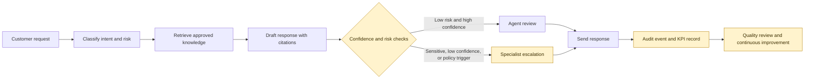
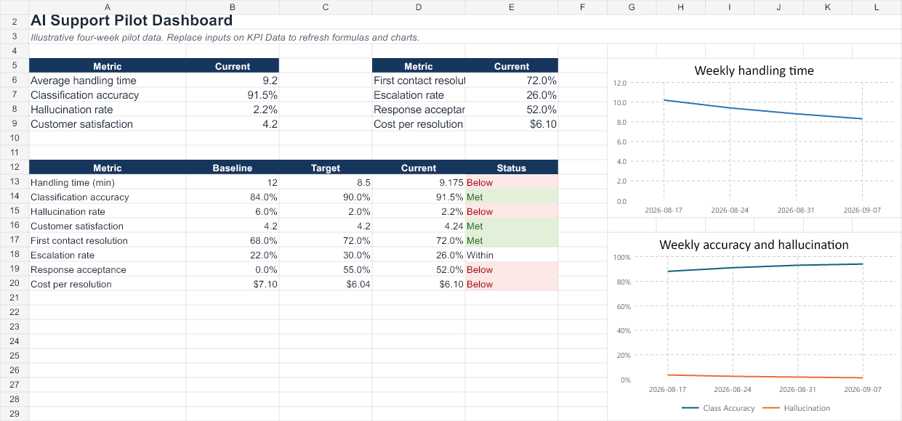

# AI Support Operating Model

Masters-level applied business analysis project for designing, governing, evaluating, and delivering an AI-assisted customer-support operating model.

## Executive summary

This portfolio examines a fictional support organization that handles customer requests manually. The proposed operating model assists with request classification, approved-knowledge retrieval, response drafting, risk-based escalation, human review, auditability, and service-performance reporting.

The recommendation is a controlled pilot for English email and web requests. Human approval remains mandatory for every response during the pilot. Expansion depends on measurable evidence across service performance, AI quality, customer outcomes, privacy, and high-risk case capture.

The project demonstrates how a Business Analyst connects business outcomes, process design, requirements engineering, system integration, data governance, responsible AI, testing, and benefits realization.

## Visual overview

The operating model is intentionally human-governed: AI accelerates triage and drafting, while approved knowledge, confidence thresholds, risk rules, and agent review control what can reach a customer.

**Pilot guardrails:** 100% human approval, approved-source retrieval, traceable citations, risk-based escalation, prompt/model versioning, and measurable release gates.

| Pilot evidence snapshot | Target / decision rule |
| --- | --- |
| Classification accuracy | ≥ 90% |
| Unsupported-claim rate | < 2% in blind review |
| Known high-risk capture | 100% in release sample |
| Customer satisfaction | ≥ 4.2 / 5 |
| Severity 1–2 defects | 0 open before expansion |

## Pilot evaluation findings

The illustrative pilot is promising but not ready for unrestricted rollout. Classification accuracy reached **91.5%** and average handling time fell from 12 minutes to **9.175 minutes**, showing real agent-capacity potential. However, unsupported claims remain at **2.2%** against a less-than-2% release gate, and response acceptance is **52%** against a 55% target. The practical conclusion is to continue a controlled pilot with human approval while improving retrieval grounding and draft quality.

[Read the full management interpretation and data-quality notes](FINDINGS.md).

*The dashboard makes the trade-off visible: service efficiency and classification are improving, while safety and acceptance still determine whether the model is ready to scale.*

## Why this is Masters level

The work treats AI adoption as a socio-technical change rather than a model-installation exercise. It includes:

- A mixed-method research design with research questions, sampling logic, triangulation, validity threats, ethics, and study limitations
- Current-state and future-state process analysis with root-cause and gap analysis
- Business, functional, nonfunctional, integration, data, and control requirements
- A requirements traceability chain from business outcomes to tests and release evidence
- Pre-specified AI evaluation measures including Macro F1, critical-class recall, calibration error, grounding rate, retrieval recall, risk recall, and subgroup analysis
- A pilot design using randomized assignment where feasible, matched comparison when not, confidence intervals, contamination controls, and protocol-deviation reporting
- A scenario-based business case that separates capacity value from committed cash savings
- Human-in-the-loop controls, information governance, model and prompt versioning, audit events, change strategy, RAID management, and formal decision rights

## Repository contents

| Artifact | Purpose |
| --- | --- |
| `AI_Customer_Support_Masters_Project.docx` | Full report covering charter, stakeholders, process transformation, requirements, architecture, evaluation design, governance, business case, limitations, and recommendation |
| `AI_Support_Masters_Workbook.xlsx` | Backlog, RTM, data mapping, API requirements, UAT, defect log, KPI dashboard, evaluation design, business case, governance RAID, and decision log |
| `AI_Support_Masters_Defense.pptx` | 13-slide executive and academic defense presentation |

## Requirement-to-evidence map

| Capability | Evidence |
| --- | --- |
| Requirements elicitation | Research framing, stakeholder matrix, BRD, functional and nonfunctional requirements |
| Process transformation | Current-state process, future-state workflow, root-cause analysis, gap analysis |
| Agile delivery | Product backlog, user stories, acceptance criteria, sprint sequencing, change control |
| Technical analysis | Data mapping, API contracts, JSON examples, SQL KPI validation, architecture boundaries |
| Responsible AI | Risk taxonomy, mandatory review rules, grounding controls, privacy, prompt injection, auditability |
| Testing and assurance | UAT plan, 15 test cases, defect log, RTM, release gates |
| Analytics and benefits | KPI definitions, formula-driven dashboard, evaluation design, scenario business case |
| Stakeholder management | Stakeholder matrix, decision rights, governance RAID, change strategy |

## Core release conditions

The pilot expansion decision requires four consecutive weeks meeting all approved conditions:

- At least 90% classification accuracy
- Less than 2% unsupported-claim rate in blind review
- 100% capture of known high-risk cases in the release sample
- Customer satisfaction at or above 4.2 out of 5
- Demonstrated handling-time and cost benefit after review and operating costs
- No open Severity 1 or Severity 2 defects

## Important assumption

This is a simulated portfolio and academic case. Volumes, costs, targets, and pilot observations are illustrative planning assumptions. They must be replaced with approved organizational data before any real investment, production deployment, or performance claim.

## Suggested review order

1. Read the executive synthesis and recommendation in the DOCX report.
2. Review the future-state process and risk controls.
3. Open the workbook Dashboard, RTM, Evaluation Design, Business Case, and Governance RAID tabs.
4. Use the presentation for the executive narrative.

## Skills demonstrated

Business analysis, requirements engineering, BPMN-style process analysis, stakeholder management, Agile and Jira, UAT, RTM, SQL, APIs, JSON, data mapping, system integration, Power BI-ready KPI design, Claude and prompt engineering concepts, LLM evaluation, human-in-the-loop controls, privacy, responsible AI, benefits realization, and executive communication.
